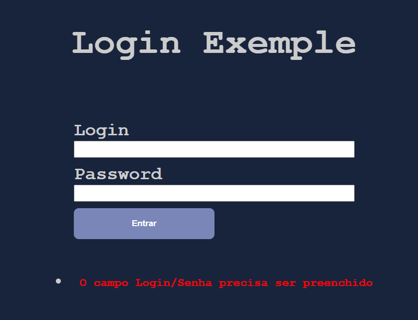
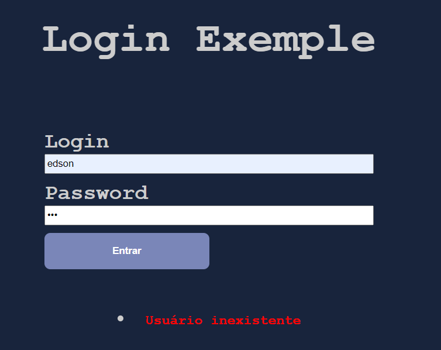

# Sistema de Login PHP Procedural

1. Criar um banco sistemalogin;
```sql
CREATE DATABASE sistemalogin;
USE sistemalogin;
```

2. Criar tabela usuarios;
```sql
CREATE TABLE `usuarios` (
	`id` INT NOT NULL AUTO_INCREMENT PRIMARY KEY, 
	`nome` VARCHAR(255) NOT NULL, 
    `login` VARCHAR(255) NOT NULL , 
    `senha` VARCHAR(32) NOT NULL 
);
```

3. Inserir o seguinte registro.
```sql
INSERT 
    INTO `usuarios` 
        (`nome`, `login`, `senha`) 
    VALUES 
        ('Edson Lopes Jr', 'admin', MD5('123456'));
```

4. Criar um formulário.

```html
<body>
    <h1>Login Exemple</h1>
    <form action="<?php echo $_SERVER['PHP_SELF']; ?>" method="POST">

        <label for="login">Login</label>
        <input type="text" name="login">

        <label for="senha">Password</label>
        <input type="password" name="senha">

        <button type="submit" name="btn_entrar"> Entrar </button>
    </form>
</body>
```

5. Verificar o evento ao ser clicado.
```php
<?php 
    if(isset($_POST['btn_entrar'])) {
        echo "Entrou";
    }
?>
```

6. crie um arquivo `db_connect/index.php` para fazer a conexão com o banco de dados.

```php
<?php
$servername = "localhost";
$username = "root";
$password = "";
$db_name = "sistemalogin";

// para funcionar tem ativar a extensão no arquivo php.ini mysqli_connect
$connect = mysqli_connect($servername, $username, $password, $db_name);

if(mysqli_connect_error()) {
    echo "Falha na conexão: ".mysqli_connect_error();
}
```
execute o comando para abrir um servido embutido.
```csharp
php -S localhost:5000
```
> [::1]:52270 [200]: GET /

7. Tratando erros `index.php`
```php
<?php
// Conexão BD
    require_once 'db_connect/index.php';

    if(isset($_POST['btn_entrar'])) {
            $erros = array();
            $login = mysqli_escape_string($connect, $_POST['login']);
            $senha = mysqli_escape_string($connect, $_POST['senha']);

            if(empty($login) || empty($senha)) {
                $erros[] = "<li> <span>O campo Login/Senha precisa ser preenchido</span> </li>";
            } else {

            }
    }
?>
```
```html
<body>
    <h1>Login Exemple</h1>
  
    <form action="<?php echo $_SERVER['PHP_SELF']; ?>" method="POST">

        <label for="login">Login</label>
        <input type="text" name="login">

        <label for="senha">Password</label>
        <input type="password" name="senha">

        <button type="submit" name="btn_entrar"> Entrar </button>
    </form>
    <?php 
        if(!empty($erros)) {
            foreach($erros as $erro) {
                echo $erro;
            }
        }
    ?>
</body>
```

A função `mysqli_real_escape_string()` é uma função embutida no PHP que é usada para escapar de todos os caracteres especiais para uso em uma consulta SQL . É usado antes de inserir uma string em um banco de dados, pois remove quaisquer caracteres especiais que possam interferir nas operações de consulta.

8. Verificando AUTENTICAÇÃO do usuário.

```PHP
if(isset($_POST['btn_entrar'])) {
        $erros = array();
        $login = mysqli_escape_string($connect, $_POST['login']);
        $senha = mysqli_escape_string($connect, $_POST['senha']);

        // Verificar se o campo Login ou Senha está vazio
        if(empty($login) || empty($senha)) {
            $erros[] = "<li> <span>O campo Login/Senha precisa ser preenchido</span> </li>";
        } else {
            $sql = "SELECT login FROM usuarios WHERE login = '$login'";
            $resultado = mysqli_query($connect, $sql);

            // Verificando se tem registro;
            if(mysqli_num_rows($resultado) > 0) {

                // Criptografa a Senha
                $senha = md5($senha);


                // Verifica se Login e Senha estão corretas
                $sql = "SELECT * FROM usuarios WHERE login = '$login' AND senha = '$senha'";
                $resultado = mysqli_query($connect, $sql);
                if(mysqli_num_rows($resultado) === 1) {

                    // Obtendo os dados do banco de dados
                    $dados = mysqli_fetch_array($resultado);
                    $_SESSION['logado'] = true;
                    $_SESSION['nome_usuario'] = $dados['nome'];
                    header('Location: public\home.php');
                } else {
                    $erros[] = "<li><span>Senha Incorreta</span> </li>";
                }
            } else {
                $erros[] = "<li> <span>Usuário inexistente</span> </li>";
            }
            
            
        }
    }
```

8. Criando a pasta `public/home.php`
```php
<?php 
// Conexão BD
    require_once '../db_connect/index.php';

// Sesssão
session_start();

//Verificação

// Verificando se Tem sessão aberta
if(!isset($_SESSION['logado'])) {
    header('Location: ../index.php');
}

// Dados
$id = $_SESSION['id_usuario'];
$sql = "SELECT * FROM usuarios WHERE id = '$id'";
$resultado = mysqli_query($connect, $sql);
$dados = mysqli_fetch_array($resultado);

// Fechando a coneção
mysqli_close($connect);
?>
```
```html
<body>
    <h1>Página principal</h1>
    <p>Seja bem vindo <?php echo $dados['nome'];?></p>
    <a href="logout.php"><button>Sair</button></a><!-- Para encerrar a Sessão -->
</body>
```

`public\logout.php`:

```php 
<?php

session_start();
session_unset();
session_destroy();
header('Location: ../index.php');
```

Resultado do projeto:
- Se não existir usuario cadastrado:


- Caso o usuario ou senha estejam incorretos:


- Caso os dados preenchidos estejam corretos
